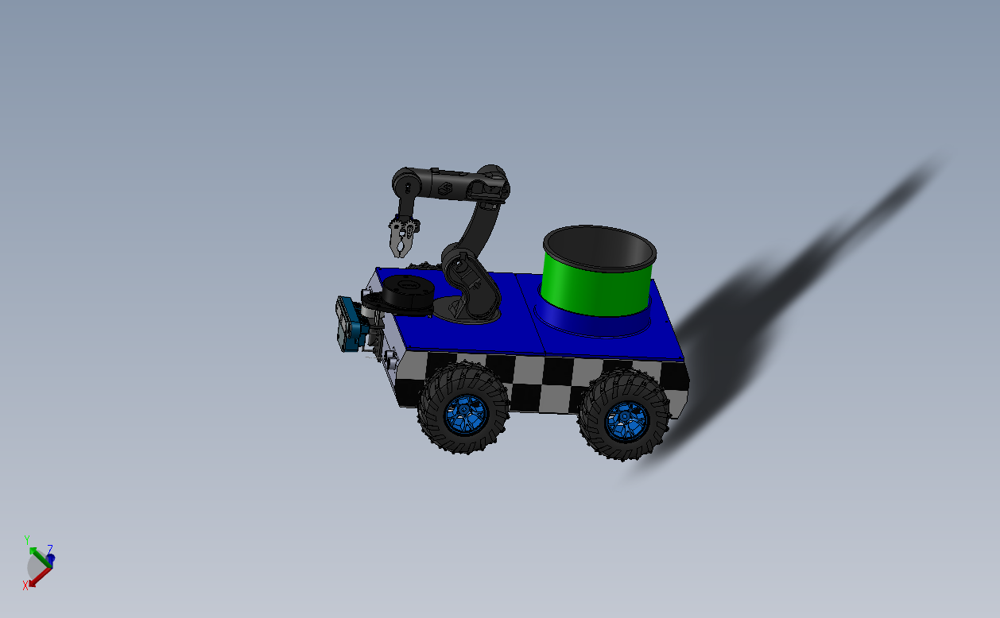
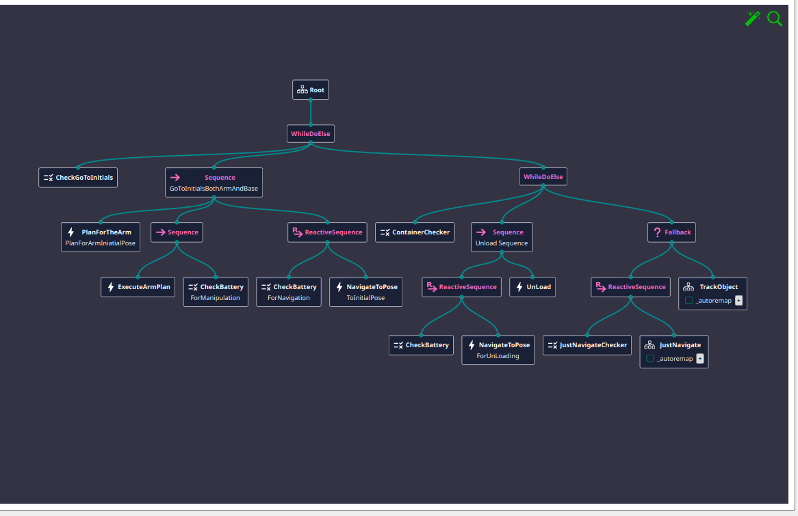

# WSTTA AGRI BOT

[](./LICENSE)
[](https://docs.ros.org/en/jazzy/)
[](https://www.behaviortree.dev/)
[](https://wstta-agri-docs.wstta-all.workers.dev/)

Part of the **WSTTA AGRI BOT** project — an autonomous mobile manipulator for agricultural tasks (navigation, object picking, and container unloading).


*CAD model of the mobile manipulator: differential-drive base with off-road wheels, onboard container, and manipulator arm.*

`mm_behaviors` is the **task-level orchestration package**. It implements the robot's decision-making logic using [BehaviorTree.CPP v4](https://www.behaviortree.dev/), deciding *when* the robot should navigate, manipulate, unload, or return to its initial pose — based on battery level, container state, and target object availability. It does not implement navigation or arm planning itself; instead it calls into the dedicated packages below through custom BT action/condition nodes.

## Where this package fits in WSTTA AGRI BOT

| Package | Role |
|---|---|
| **`mm_behaviors`** | **Behavior Tree implementation + full-system launch scripts** |
| `mm_bringup` | Robot description: URDF files, meshes, and the simulation world |
| `mm_nav` | Navigation stack (path planning, Nav2 integration) setup |
| `mm_moveit` | Arm motion with MoveIt2 integration setup|
| `mm_perception` | Object/station detection and pose estimation |
| `custom_interfaces` | not actually used in the project, but for concept pre-testing purposes |

`mm_behaviors` implements the high-level orchestration logic (the behavior tree and its custom nodes) and also owns the top-level launch scripts that bring up the full system — simulation (Gazebo), navigation, MoveIt2, and the tree itself. It reads sensor/perception state (battery, container, object poses) from the blackboard and triggers navigation and manipulation packages via their respective interfaces, without containing any low-level control logic itself. The robot's physical description (URDF/meshes/world) lives in `mm_bringup` and is used by the simulation launch, not by this package directly.

## Requirements

- ROS 2 **Jazzy**
- [BehaviorTree.CPP v4](https://www.behaviortree.dev/)
- Nav2, MoveIt 2
- Doxygen + Graphviz (optional, for regenerating API documentation)

## Simulation (Gazebo)

The full-system launch scripts (`launch_robot.bash` / `launch_all_nav_gz_moveit.bash`) start the robot in **Gazebo Harmonic** (paired with ROS 2 Jazzy), using the world and robot description (URDF/meshes) defined in `mm_bringup`.

- **Sensors:** the robot is designed for **outdoor use** and currently relies on  **2D LiDAR** and **IMU and Encoders data fusion** . Both ar simulated via Gazebo plugins in the world/robot description from `mm_bringup`.
- A discrete GPU is recommended for smoother rendering, especially with the depth camera plugin active.
- If the simulation runs slower than real-time, this can affect the battery-gated behavior tree timing and navigation accuracy — worth keeping in mind when debugging unexpected tree behavior in simulation vs. on the real robot.
- The simulated terrain in the world file should ideally reflect the unevenness of real outdoor deployment conditions, since this is one of the known limitations affecting depth camera and GPS-based pose estimation (see [Known limitations](#for-the-next-user-continuing-this-project) below).

## Build

```bash
cd ~/Ros2_ws
colcon build --packages-select custom_interfaces mm_perception mm_nav mm_moveit mm_behaviors
source install/setup.bash
```

> Build order matters: `mm_behaviors` depends on `custom_interfaces` and the other packages' interfaces, so build those first (or build the whole workspace with `colcon build`).

## Launch

Two launch scripts, located at the same level as the workspace's `src` folder, bring up the full system (simulation, navigation, MoveIt2, and the behavior tree). Pick whichever fits your use case.

### Option 1 — Full system in one command

```bash
./launch_robot.bash
```
This runs the whole pipeline (simulation/Gazebo, navigation, MoveIt2, and the behavior tree) in the correct order.

### Option 2 — Split across two terminals

Useful when you want the behavior tree in its own terminal (e.g. to watch its logs separately).

**Terminal 1** — launches simulation, navigation, and MoveIt2:
```bash
./launch_all_nav_gz_moveit.bash
```

**Terminal 2** — launches only the behavior tree node:
```bash
ros2 launch mm_behaviors bt_node_only.launch.py
```

### Option 3 — Manual, one process per terminal (for debugging)

Open `launch_robot.bash` to see the exact order the underlying processes are started in, then launch each one individually in its own terminal. This makes it easy to isolate which component is failing, restart a single process without killing the rest, or attach a debugger to one node at a time.

```bash
cat launch_robot.bash   # inspect the launch order
```

## Architecture overview

The behavior tree is defined in XML (`BTCPP_format="4"`) and executed by `WsttaBtPipelineNode` (in `mm_bt_node.cpp`). It's built from one main tree and three reusable subtrees.


*The full tree as visualized in Groot2, showing the `MainTree`'s branching logic and its `TrackObject`/`JustNavigate` subtrees.*

### `MainTree` — top-level decision loop

Runs continuously, choosing one of three modes each cycle:

```
MainTree
├── IF CheckGoToInitials == true
│     → Plan arm to initial pose
│     → Execute arm plan (gated by battery check)
│     → Navigate to initial pose (gated by battery check)
│
└── ELSE
      ├── IF ContainerChecker (container full) == true
      │     → Navigate to unload zone (battery-gated)
      │     → UnLoad
      │
      └── ELSE (container has space → keep working)
            ├── IF JustNavigateChecker == true
            │     → run [JustNavigate](#justnavigate) subtree
            └── ELSE
                  → run [TrackObject](#trackobject) subtree
```

### `TrackObject` — full pick cycle

1. Navigate near the detected object (`NavigateToPose`, battery-gated via `ReactiveSequence`)
2. Plan arm motion to the object (`PlanForTheArm`)
3. Open gripper, execute the arm plan to reach the object (battery-gated)
4. Call the [`Dropsequence`](#dropsequence) subtree to place the object

### `Dropsequence` — placing the object

A sequence of four battery-gated plan/execute stages:
1. Grasp confirmation (`PlanExecForGripper`) → move to pre-drop pose → execute
2. Move to the actual drop pose → execute → open gripper
3. Close gripper (reset) → move to pre-drop pose → execute
4. Return arm to initial pose → execute

### `JustNavigate` — navigation-only mode

A lightweight reactive sequence: check battery, then navigate along a long path (`NavigateToPose` with `key="in_global_long_path"`). Used when no manipulation is required for the current cycle.

### Battery safety

Every arm execution and every navigation call in the tree is gated by a `CheckBattery` condition node (`percentage_treshold="25.0"`). If the battery drops below threshold, the corresponding branch fails closed rather than attempting a motion, preventing the robot from stranding itself mid-task.

## Behavior Tree nodes reference

### Condition nodes (`condition_nodes.hpp` / `.cpp`)

| Node | Description |
|---|---|
| `CheckBattery` | Returns SUCCESS if `battery_percentage` ≥ `percentage_treshold` (default 25%) |
| `CheckGoToInitials` | Returns SUCCESS if the robot has been instructed to return to its initial pose |
| `ContainerChecker` | Returns SUCCESS if the onboard container is full and needs unloading |
| `JustNavigateChecker` | Returns SUCCESS if the current cycle requires navigation only (no object to manipulate) |

### Action nodes — navigation (`mm_nav_actions.hpp` / `.cpp`)

| Node | Description |
|---|---|
| `NavigateToPose` | Sends a navigation goal to `mm_nav`; `key` selects which target pose to use (initial, long path, unload zone, near object) |

### Action nodes — arm/gripper (`mm_moveit_actions.hpp`, `mm_moveit_bt_nodes.hpp`, `actions_nodes.hpp` and matching `.cpp` files)

| Node | Description |
|---|---|
| `PlanForTheArm` | Plans an arm trajectory via `mm_moveit` for a given `plan_key` (e.g. `for_object`, `arm_drop_prod_pose`, `arm_initial_pose`) |
| `ExecuteArmPlan` | Executes a previously planned arm trajectory (`onStart`/`onRunning`/`onHalted` — stateful action) |
| `PlanExecForGripper` | Plans and executes gripper motion (`open`, `close`, `grasp`) |
| `UnLoad` | Triggers the unloading sequence when the container is full |
| `StackObjectPose` | Computes the stacking pose for placing an object |
| `GetLongPathGoalPose` | Computes the goal pose for long-distance navigation |

### Main pipeline node (`mm_bt_node.hpp` / `.cpp`)

| Class | Description |
|---|---|
| `WsttaBtPipelineNode` | ROS 2 node that loads the tree XML, registers all custom nodes, ticks the tree, and listens to system topics (e.g. battery state) |

> Full parameter-level detail (ports, types, defaults) for every node is available in the generated API documentation — see below.

## Full API documentation (Doxygen)

Class-level documentation, including all ports, parameters, and inheritance diagrams, is generated with Doxygen and published at:

👉 **https://wstta-agri-docs.wstta-all.workers.dev/**

To regenerate locally:
```bash
cd ~/Ros2_ws/src/mm_behaviors
doxygen Doxyfile
xdg-open docs/html/index.html
```

## For the next user continuing this project

1. Start with `mm_bt_node.cpp` — this is where the tree is loaded and ticked, and where all custom BT nodes are registered.
2. The tree logic itself lives in the BT XML file (not in this repo's `.cpp` files) — read that first to understand *when* things happen, then read the corresponding node class to understand *how*.
3. Condition nodes are simple (`condition_nodes.cpp`); action nodes that talk to `mm_nav`/`mm_moveit` are stateful (`onStart`/`onRunning`/`onHalted`) since they wrap asynchronous ROS 2 actions.
4. **To add a new BT node:**
   - Create the class in the relevant header (`actions_nodes.hpp` for a generic action, or a dedicated file if it's a new category)
   - Implement `providedPorts()` and `tick()` (or `onStart`/`onRunning`/`onHalted` for stateful actions)
   - Register the node in `mm_bt_node.cpp` alongside the existing registrations
   - Add the node's ID and ports to the `<TreeNodesModel>` section of the BT XML so it shows correctly in Groot
5. **Known limitations / TODO:**
   - **Perception pipeline is not yet well-designed** — the object detection/pose estimation used by `mm_perception` is not robust enough to reliably pick objects in all conditions. This is one of the main areas needing improvement before real-world deployment.
   - **Pose estimation on uneven outdoor terrain** — the robot relies on a **depth camera** and **GPS** for outdoor localization and object/container detection. On uneven terrain, both are affected: the depth camera's estimate of object pose shifts with the robot's tilt, and GPS alone lacks the precision needed for fine manipulation targets. A more robust approach (e.g. IMU/GPS fusion, terrain-aware calibration, or adding a secondary sensor) would be needed to handle this reliably.
     
6. Use **Groot2** to load the BT XML and visually inspect/edit the tree instead of editing the XML by hand where possible.

## Author

THOMAS KAFANDO (thomass.kaf20@gmail.com) — WSTTA AGRI BOT, Master's final internship project (2026)

## License

This project is licensed under the **Apache License 2.0** — see the [LICENSE](./LICENSE) file for the full text.

Apache 2.0 was chosen for consistency with the broader ROS 2 ecosystem this project depends on: ROS 2 core is Apache 2.0, while Nav2 and MoveIt2 are BSD-3-Clause — both permissive and fully compatible with Apache 2.0. Apache 2.0 additionally includes an explicit patent grant, which is useful given the manipulation and perception work involved in this project.
